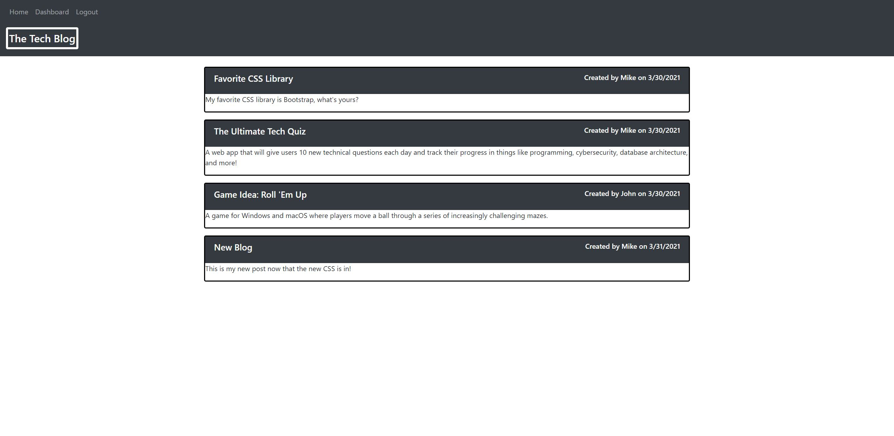
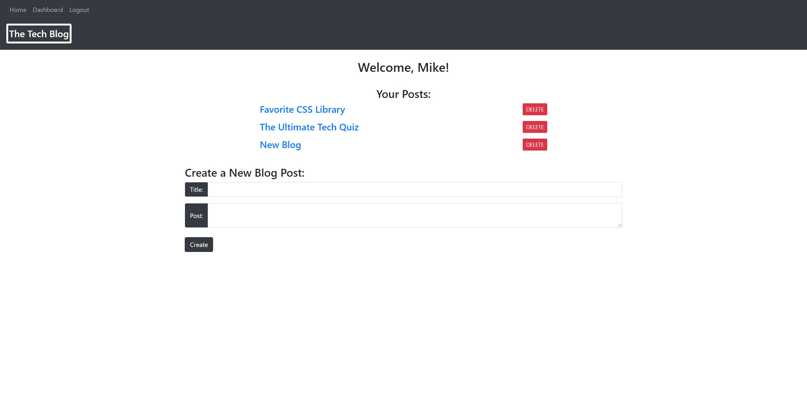
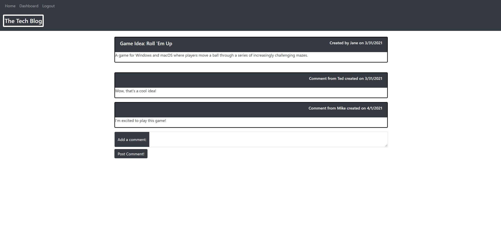

# Tech-Blog

## Description
    
I created a tech blog using the MVC model of design. MySQL stores the models on the database, while I used bootstrap and handlebars to design the front-end. Users can post, comment, and delete their posts if they are logged in.
    
## Table of Contents
1. [Installation](#installation)
2. [Usage](#usage)
3. [License](#license)
4. [Questions](#questions)
5. [Credits](#credits)
    
## Installation
    
[Deployed Application](https://infinite-springs-87893.herokuapp.com/)
    
## Usage

## License
    
MIT License
    
Copyright (c) 2021 Mike Coletta
          
## Questions?
    
[Github](https://github.com/MikeColetta)
    
For any questions, please send me an [email](mailto:coletta.mike@gmail.com).